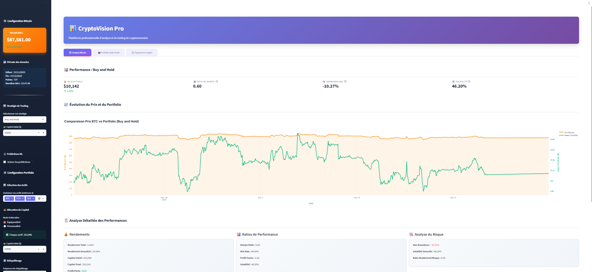
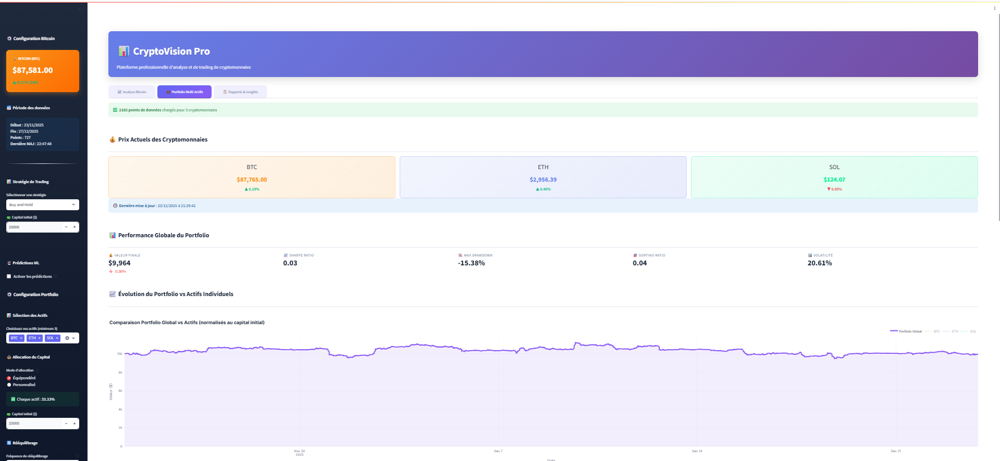
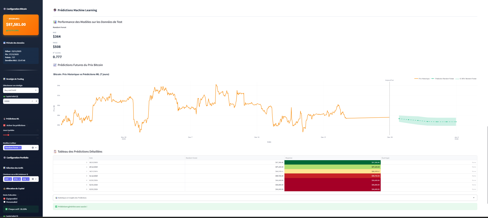

# 📊 CryptoVision Pro - Plateforme d'Analyse Quantitative de Cryptomonnaies

<div align="center">


**Plateforme professionnelle de trading quantitatif et d'analyse de portefeuille pour les cryptomonnaies**

[Démo Live](https://cryptovisionpro.hopto.org) • [Documentation](#documentation) • [Installation](#installation) • [Contact](#contact)

</div>

---

## 📋 Table des Matières

- [Vue d'ensemble](#-vue-densemble)
- [Fonctionnalités](#-fonctionnalités)
- [Technologies](#-technologies-utilisées)
- [Architecture](#-architecture-du-projet)
- [Installation](#-installation)
- [Utilisation](#-utilisation)
- [Déploiement](#-déploiement)
- [Structure du Projet](#-structure-du-projet)
- [Modules](#-modules-détaillés)
- [API et Sources de Données](#-api-et-sources-de-données)
- [Captures d'écran](#-captures-décran)

---

## 🎯 Vue d'ensemble

**CryptoVision Pro** est une plateforme d'analyse quantitative avancée pour les cryptomonnaies, développée dans le cadre d'un projet académique de finance quantitative. Elle combine l'analyse technique traditionnelle avec des techniques modernes de Machine Learning pour fournir des insights précis sur les marchés crypto.

### 🎓 Contexte Académique

Ce projet a été développé pour le cours **"Python, Git & Linux pour la Finance"** avec les objectifs suivants :
- Développement d'une application financière en production
- Collaboration via Git et GitHub
- Déploiement sur serveur Linux (AWS EC2)
- Intégration de stratégies quantitatives et de ML
- Architecture scalable et professionnelle

### 🏆 Points Forts

- ✅ **2 Modules Distincts** : Analyse d'actif unique (Module A) et gestion de portefeuille (Module B)
- ✅ **5+ Stratégies de Trading** : Buy & Hold, MA Crossover, Momentum, etc.
- ✅ **3 Modèles ML de Prédiction** : Linear Regression, Random Forest, ARIMA
- ✅ **Dashboard Interactif** : Interface Streamlit moderne et responsive
- ✅ **Mise à Jour Temps Réel** : Données actualisées toutes les 5 minutes
- ✅ **Rapports Automatiques** : Génération quotidienne via Cron
- ✅ **Déploiement Production** : AWS EC2 + Nginx + SSL (Let's Encrypt)
- ✅ **Métriques Avancées** : Sharpe, Sortino, Calmar, Max Drawdown

---

## ✨ Fonctionnalités

### 📈 Module A : Analyse d'Actif Unique (Bitcoin)

#### Stratégies de Trading
- **Buy and Hold** : Stratégie d'investissement passive
- **Moving Average Crossover** : Signaux basés sur le croisement de moyennes mobiles
- **Simple Momentum** : Suivi de tendance avec indicateurs techniques

#### Métriques de Performance
- **Rendements** : Total, annualisé, par période
- **Risque** : Volatilité, Max Drawdown, VaR
- **Ratios** : Sharpe, Sortino, Calmar, Win Rate, Profit Factor
- **Analyse Technique** : RSI, MACD, Bollinger Bands

#### 🔮 Prédictions Machine Learning (BONUS)
- **3 Modèles ML** :
  - Linear Regression (régression linéaire)
  - Random Forest (forêt aléatoire)
  - ARIMA (modèle autorégressif)
- **Intervalles de Confiance** : Prédictions avec bornes supérieures et inférieures
- **Feature Importance** : Analyse des variables les plus influentes
- **Validation Croisée** : Métriques MAE, RMSE, R² score
- **Horizons de Prédiction** : 3 à 30 jours configurables

### 💼 Module B : Gestion de Portefeuille Multi-Actifs

#### Fonctionnalités Portfolio
- **Sélection Flexible** : 3 à 8+ cryptomonnaies (BTC, ETH, SOL, ADA, BNB...)
- **Allocation** : Poids égaux ou personnalisés
- **Rebalancing** : Aucun, hebdomadaire, ou mensuel
- **Diversification** : Analyse de corrélation et d'efficience

#### Analyses Avancées
- **Matrice de Corrélation** : Visualisation des relations entre actifs
- **Frontière Efficiente** : Optimisation rendement/risque
- **Value at Risk (VaR)** : Estimation des pertes potentielles
- **Analyse de Contribution** : Impact de chaque actif sur le portfolio

### 📋 Système de Rapports

#### Rapports Automatisés
- **Quotidien** : Généré automatiquement à 20h00 (configurable)
- **Format** : TXT avec export possible en PDF
- **Contenu** :
  - Résumé des performances sur 24h
  - Statistiques détaillées (open, close, high, low)
  - Volatilité et drawdown
  - Top performer / Worst performer
  - Alertes de risque automatiques

#### Visualisations
- **Graphiques Interactifs** : Plotly avec zoom, pan, export
- **Tableaux Dynamiques** : Tri, filtrage, export CSV/Excel
- **Heatmaps** : Corrélations et performance

---

## 🛠️ Technologies Utilisées

### Backend & Data Processing
```
Python 3.8+              # Langage principal
Pandas 2.1.4             # Manipulation de données
NumPy 1.26.2             # Calculs numériques
Scikit-learn 1.3.2       # Machine Learning
Statsmodels 0.14.0       # Modèles statistiques (ARIMA)
```

### Frontend & Visualisation
```
Streamlit 1.29.0         # Framework web interactif
Plotly 5.18.0            # Graphiques interactifs
Plotly Express           # Visualisations rapides
```

### Data Sources
```
CoinGecko API            # Prix crypto en temps réel
                         # Gratuit, pas de clé API requise
                         # Mise à jour toutes les 1-2 minutes
```

### Infrastructure & DevOps
```
AWS EC2 (t2.micro)       # Serveur d'hébergement
Ubuntu 24.04 LTS         # Système d'exploitation
Nginx 1.24               # Reverse proxy
Certbot / Let's Encrypt  # Certificats SSL gratuits
Systemd                  # Gestion des services
Cron                     # Tâches planifiées
Git / GitHub             # Contrôle de version
```

### Sécurité & Performance
```
HTTPS/TLS 1.3            # Connexions sécurisées
Rate Limiting            # Protection contre les abus
Caching                  # Optimisation des performances
Logging                  # Audit et debugging
```

---

## 🏗️ Architecture du Projet

### Architecture Système
```
┌─────────────────────────────────────────────────────────────┐
│                        UTILISATEUR                          │
└────────────────────┬────────────────────────────────────────┘
                     │ HTTPS (Port 443)
                     ▼
┌─────────────────────────────────────────────────────────────┐
│                    NGINX REVERSE PROXY                      │
│  • SSL/TLS Termination                                      │
│  • Load Balancing                                           │
│  • Static File Serving                                      │
└────────────────────┬────────────────────────────────────────┘
                     │ HTTP (Port 8501)
                     ▼
┌─────────────────────────────────────────────────────────────┐
│               STREAMLIT APPLICATION                         │
│  ┌─────────────────────────────────────────────────────┐   │
│  │  MODULE A            MODULE B         REPORTS       │   │
│  │  (Bitcoin)        (Portfolio)       (Analytics)     │   │
│  └─────────────────────────────────────────────────────┘   │
│                          │                                  │
│                          ▼                                  │
│  ┌─────────────────────────────────────────────────────┐   │
│  │         BUSINESS LOGIC LAYER                        │   │
│  │  • strategies.py                                    │   │
│  │  • portfolio_engine.py                              │   │
│  │  • predictor.py (ML)                                │   │
│  └─────────────────────────────────────────────────────┘   │
└────────────────────┬────────────────────────────────────────┘
                     │
        ┌────────────┴────────────┐
        ▼                         ▼
┌──────────────────┐    ┌──────────────────────┐
│  DATA SERVICES   │    │  EXTERNAL APIs       │
│                  │    │                      │
│ • fetch_data.py  │◄───┤ CoinGecko API        │
│ • continuous_    │    │  (Free, No Key)      │
│   fetch.py       │    │                      │
│                  │    └──────────────────────┘
└────────┬─────────┘
         │
         ▼
┌──────────────────────────────────────┐
│      LOCAL DATA STORAGE              │
│  • data/bitcoin_prices.csv           │
│  • data/portfolio_prices.csv         │
│  • reports/*.txt                     │
└──────────────────────────────────────┘
```

### Architecture Applicative
```
app.py (Main Application)
│
├── Module A (Single Asset)
│   ├── Data Loading & Caching
│   ├── Strategy Selection
│   │   ├── Buy & Hold
│   │   ├── MA Crossover
│   │   └── Simple Momentum
│   ├── Backtesting Engine
│   ├── Metrics Calculator
│   ├── ML Predictions (BONUS)
│   │   ├── Linear Regression
│   │   ├── Random Forest
│   │   └── ARIMA
│   └── Visualization
│
├── Module B (Portfolio)
│   ├── Multi-Asset Loading
│   ├── Weight Allocation
│   │   ├── Equal Weight
│   │   └── Custom Weights
│   ├── Rebalancing Logic
│   ├── Portfolio Metrics
│   ├── Correlation Analysis
│   └── Visualization
│
└── Module C (Reports)
    ├── Report Generation
    ├── Report History
    └── Export (TXT/PDF)
```

---

## 🚀 Installation

### Prérequis
```bash
# Système
- Python 3.8 ou supérieur
- Git
- pip (gestionnaire de paquets Python)

# Optionnel (pour déploiement)
- Serveur Linux (Ubuntu 20.04+ recommandé)
- Nginx
- Certbot (pour SSL)
```

### Installation Locale

#### 1. Cloner le Repository
```bash
git clone https://github.com/votre-username/Crypto-Quant-Analytics-Platform.git
cd Crypto-Quant-Analytics-Platform
```

#### 2. Créer un Environnement Virtuel
```bash
# Linux/Mac
python3 -m venv venv
source venv/bin/activate

# Windows
python -m venv venv
venv\Scripts\activate
```

#### 3. Installer les Dépendances
```bash
pip install -r requirements.txt
```

**Contenu de `requirements.txt` :**
```txt
streamlit==1.29.0
pandas==2.1.4
numpy==1.26.2
requests==2.31.0
plotly==5.18.0
scikit-learn==1.3.2
statsmodels==0.14.0
```

#### 4. Récupérer les Données Initiales
```bash
# Données Bitcoin (Module A)
python scripts/fetch_data.py

# Données Portfolio (Module B)
python scripts/fetch_portfolio_data.py
```

#### 5. Lancer l'Application
```bash
streamlit run app.py
```

L'application sera accessible sur : `http://localhost:8501`

---

## ⚙️ Configuration

### Structure des Dossiers
```bash
# Créer les dossiers nécessaires
mkdir -p data reports logs cron
```

---

## 📖 Utilisation

### Mise à Jour Automatique des Données

#### Terminal 1 : Bitcoin (Module A)
```bash
python scripts/continuous_fetch.py
```

#### Terminal 2 : Portfolio (Module B)
```bash
python scripts/continuous_portfolio_fetch.py
```

#### Terminal 3 : Dashboard
```bash
streamlit run app.py
```

### Génération de Rapports

#### Manuel
```bash
# Rapport Bitcoin
python scripts/daily_report.py

# Rapport Portfolio
python scripts/portfolio_daily_report.py
```

#### Automatique (Cron)
```bash
# Éditer crontab
crontab -e

# Ajouter (rapport à 20h00 chaque jour)
0 20 * * * cd /chemin/vers/projet && python3 scripts/daily_report.py
0 20 * * * cd /chemin/vers/projet && python3 scripts/portfolio_daily_report.py
```

### Utilisation du Dashboard

#### Module A : Analyse Bitcoin

1. **Sélectionner une stratégie** dans la sidebar
   - Buy and Hold
   - MA Crossover (ajuster les paramètres)
   - Simple Momentum

2. **Configurer le capital initial** (1,000$ - 1,000,000$)

3. **Activer les prédictions ML** (optionnel)
   - Choisir les modèles (LR, RF, ARIMA)
   - Définir l'horizon de prédiction (3-30 jours)

4. **Analyser les résultats**
   - Métriques de performance
   - Graphiques interactifs
   - Prédictions futures

#### Module B : Portfolio

1. **Sélectionner 3+ cryptomonnaies**
   - BTC, ETH, SOL, ADA, BNB disponibles

2. **Choisir le mode d'allocation**
   - Équipondéré : poids égaux
   - Personnalisé : ajuster manuellement

3. **Configurer le rebalancing**
   - Aucun
   - Hebdomadaire (7 jours)
   - Mensuel (30 jours)

4. **Analyser le portfolio**
   - Performance globale
   - Comparaison avec actifs individuels
   - Matrice de corrélation
   - Diversification

---

## 🌐 Déploiement

### Déploiement sur AWS EC2

#### 1. Configuration du Serveur
```bash
# Connexion SSH
ssh -i votre-cle.pem ubuntu@votre-ip

# Mise à jour système
sudo apt update && sudo apt upgrade -y

# Installation Python et dépendances
sudo apt install python3 python3-pip git nginx certbot python3-certbot-nginx -y

# Cloner le projet
git clone https://github.com/user/Crypto-Quant-Analytics-Platform.git
cd Crypto-Quant-Analytics-Platform

# Installer dépendances Python
pip3 install -r requirements.txt
```

#### 2. Configuration Nginx
```bash
# Créer la configuration
sudo nano /etc/nginx/sites-available/cryptovision
```

**Contenu :**
```nginx
map $http_upgrade $connection_upgrade {
    default upgrade;
    '' close;
}

upstream backend {
    server 127.0.0.1:8501;
    keepalive 64;
}

# Redirection HTTP -> HTTPS
server {
    listen 80;
    server_name votre-domaine.com;
    return 301 https://$server_name$request_uri;
}

# Configuration HTTPS
server {
    listen 443 ssl http2;
    server_name votre-domaine.com;

    ssl_certificate /etc/letsencrypt/live/votre-domaine.com/fullchain.pem;
    ssl_certificate_key /etc/letsencrypt/live/votre-domaine.com/privkey.pem;

    ssl_protocols TLSv1.2 TLSv1.3;
    ssl_prefer_server_ciphers on;

    location / {
        proxy_pass http://backend;
        proxy_http_version 1.1;
        proxy_set_header Upgrade $http_upgrade;
        proxy_set_header Connection $connection_upgrade;
        proxy_set_header Host $host;
        proxy_set_header X-Real-IP $remote_addr;
        proxy_set_header X-Forwarded-For $proxy_add_x_forwarded_for;
        proxy_set_header X-Forwarded-Proto $scheme;
        proxy_read_timeout 86400;
        proxy_buffering off;
    }
}
```
```bash
# Activer la configuration
sudo ln -s /etc/nginx/sites-available/cryptovision /etc/nginx/sites-enabled/
sudo rm /etc/nginx/sites-enabled/default
sudo nginx -t
sudo systemctl restart nginx
```

#### 3. Certificat SSL
```bash
sudo certbot certonly --standalone -d votre-domaine.com
```

#### 4. Service Systemd

**Créer `/etc/systemd/system/cryptovision.service` :**
```ini
[Unit]
Description=CryptoVision Pro Streamlit Application
After=network.target

[Service]
Type=simple
User=ubuntu
WorkingDirectory=/home/ubuntu/Crypto-Quant-Analytics-Platform
Environment="PATH=/home/ubuntu/.local/bin:/usr/bin"
ExecStart=/usr/bin/python3 -m streamlit run app.py --server.port=8501 --server.address=127.0.0.1 --server.headless=true
Restart=always
RestartSec=10

[Install]
WantedBy=multi-user.target
```
```bash
sudo systemctl daemon-reload
sudo systemctl enable cryptovision
sudo systemctl start cryptovision
```

#### 5. Services de Mise à Jour

**Bitcoin Fetcher (`/etc/systemd/system/bitcoin-fetch.service`) :**
```ini
[Unit]
Description=Bitcoin Data Fetcher
After=network.target

[Service]
Type=simple
User=ubuntu
WorkingDirectory=/home/ubuntu/Crypto-Quant-Analytics-Platform
ExecStart=/usr/bin/python3 scripts/continuous_fetch.py
Restart=always

[Install]
WantedBy=multi-user.target
```

**Portfolio Fetcher (`/etc/systemd/system/portfolio-fetch.service`) :**
```ini
[Unit]
Description=Portfolio Data Fetcher
After=network.target

[Service]
Type=simple
User=ubuntu
WorkingDirectory=/home/ubuntu/Crypto-Quant-Analytics-Platform
ExecStart=/usr/bin/python3 scripts/continuous_portfolio_fetch.py
Restart=always

[Install]
WantedBy=multi-user.target
```
```bash
sudo systemctl enable bitcoin-fetch portfolio-fetch
sudo systemctl start bitcoin-fetch portfolio-fetch
```

#### 6. Cron pour Rapports
```bash
crontab -e

# Ajouter
0 20 * * * cd /home/ubuntu/Crypto-Quant-Analytics-Platform && python3 scripts/daily_report.py
0 20 * * * cd /home/ubuntu/Crypto-Quant-Analytics-Platform && python3 scripts/portfolio_daily_report.py
```

---

## 📁 Structure du Projet
```
Crypto-Quant-Analytics-Platform/
│
├── app.py                          # Application Streamlit principale
├── requirements.txt                # Dépendances Python
├── README.md                       # Documentation
├── .gitignore                      # Fichiers ignorés par Git
│
├── scripts/                        # Scripts Python backend
│   ├── __init__.py
│   ├── fetch_data.py              # Récupération données Bitcoin
│   ├── fetch_portfolio_data.py    # Récupération données portfolio
│   ├── continuous_fetch.py        # Mise à jour continue Bitcoin
│   ├── continuous_portfolio_fetch.py  # Mise à jour continue portfolio
│   ├── strategies.py              # Stratégies de trading (Module A)
│   ├── portfolio_engine.py        # Gestion portfolio (Module B)
│   ├── predictor.py               # Modèles ML de prédiction (BONUS)
│   ├── daily_report.py            # Génération rapport Bitcoin
│   └── portfolio_daily_report.py  # Génération rapport portfolio
│
├── data/                          # Données locales
│   ├── bitcoin_prices.csv         # Historique Bitcoin
│   └── portfolio_prices.csv       # Historique portfolio
│
├── reports/                       # Rapports générés
│   ├── bitcoin_report_*.txt
│   └── portfolio_report_*.txt
```

---

## 🧩 Modules Détaillés

### Module A : Analyse Bitcoin (`scripts/strategies.py`)

#### Fonctions Principales

**`buy_and_hold_strategy(prices, initial_capital)`**
- Stratégie d'investissement passive
- Achète au début et conserve
- Retourne : Series de valeurs du portfolio

**`moving_average_crossover_strategy(prices, short_window, long_window, initial_capital)`**
- Signaux d'achat/vente basés sur croisement de MA
- Paramètres : périodes courte et longue
- Retourne : Series de valeurs du portfolio

**`calculate_metrics(portfolio_values, initial_capital)`**
- Calcule 8+ métriques de performance
- Retourne : Dict avec métriques (Sharpe, Drawdown, etc.)

### Module B : Portfolio (`scripts/portfolio_engine.py`)

#### Classe Portfolio

**`Portfolio(df, weights, initial_capital, rebalance)`**
- Gère un portfolio multi-actifs
- Supporte rebalancing périodique
- Méthodes :
  - `run_backtest()` : Exécute le backtest
  - `_rebalance_portfolio()` : Rebalance aux poids initiaux

**`calculate_portfolio_metrics(result_df, initial_capital)`**
- Métriques spécifiques au portfolio
- Inclut Sortino et Calmar ratios

**`calculate_correlation_matrix(df, assets)`**
- Matrice de corrélation entre actifs
- Utilisée pour analyse de diversification

### Module ML : Prédictions (`scripts/predictor.py`)

#### Classe BitcoinPredictor

**`BitcoinPredictor(df, prediction_days)`**
- Prépare features automatiquement
- Méthodes :
  - `predict_linear_regression()` : Régression linéaire
  - `predict_random_forest()` : Forêt aléatoire avec feature importance
  - `predict_arima()` : Modèle ARIMA avec intervalles de confiance
  - `compare_models()` : Compare tous les modèles

**Features Engineering**
- Temporelles : jour, heure, jour du mois
- Techniques : RSI, Moving Averages, Volatilité
- Lags : Prix passés (1, 2, 3, 7, 14 jours)

---

## 🔌 API et Sources de Données

### CoinGecko API

**URL Base :** `https://api.coingecko.com/api/v3`

#### Endpoints Utilisés

**1. Prix Multiples**
```
GET /simple/price
Params:
  - ids: bitcoin,ethereum,solana
  - vs_currencies: usd
  - include_24hr_change: true
```

**2. Données Historiques**
```
GET /coins/{id}/market_chart
Params:
  - vs_currency: usd
  - days: 30
```

**Limitations**
- Gratuit : 50 appels/minute
- Pas de clé API requise
- Données mises à jour toutes les 1-2 minutes

### Format des Données

**`bitcoin_prices.csv`**
```csv
timestamp,price,change_24h
2024-12-20 10:00:00,95432.50,2.45
2024-12-20 10:05:00,95450.20,2.47
```

**`portfolio_prices.csv`**
```csv
timestamp,BTC_price,ETH_price,SOL_price
2024-12-20 10:00:00,95432.50,3542.30,123.45
```

---

## 📸 Captures d'écran

### Dashboard Principal


### Module A : Analyse Bitcoin


### Prédictions ML


Pour une expérience complète et interactive, vous pouvez accéder à l'application en ligne ici : [CryptoVisionPro](https://cryptovisionpro.hopto.org/)
---
